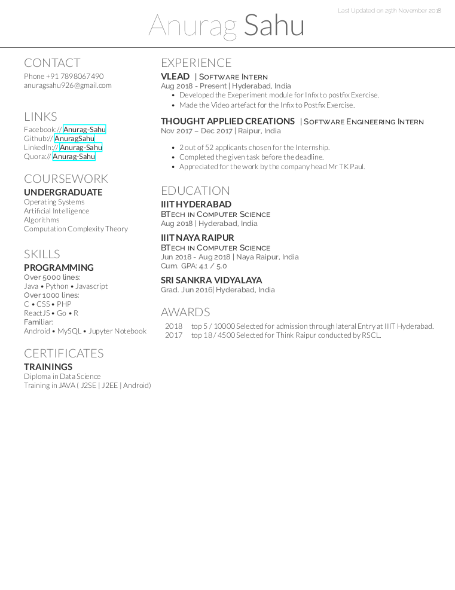

My RESUME
==============

Hey There folks,
I was just staking one of my seniors at collage through github ;P and saw the resume on his website. It was a very organised and a resume with many feathers on his hat,  
Shivam Khandewal [https://github.com/skbly7]. 
 
I searched about TeX and found out that is a very good markup language specially if you are looking for resumes. And found out that the resume templete was made by Debarghya Das [https://github.com/deedy]. He is an software engineer at Facebook. 

I really liked the resume template, so I put on my resume on top of it. 
In order to see the the resume 
## Dependencies
 on linux (I have not tried it on windows)
- install xetex and bibtex
- go to terminal
- git clone https://github.com/AnuragSahu/Deedy-Resume.git
- cd Deedy-Resume/OpenFonts/
- xelatex deedy_resume-openfonts.xtx
- tada there you go the resume is up just check the deedy_resume-openfont.pdf
 
 ## Snapshot
 
 
